<!-- @generated by @newel/generator-wiki — do not edit -->
---
title: "FerriteShortSword"
---

# FerriteShortSword

`item`

Standard single-edged blade forged from a refined ferrite ingot. Lightweight and quick; chips against armoured opponents but reliable for unarmoured targets.

> Entry-level sidearm; every new player can craft one with basic smithing knowledge

## Attributes

| Field | Type | Description |
| ----- | ---- | ----------- |
| condition | `pristine`, `worn`, `damaged`, `broken` |  |
| weight | decimal | kg |
| rarity | `common`, `uncommon`, `rare`, `epic`, `legendary` |  |
| stackable | boolean | Always false for weapons |
| durability | integer | Remaining durability points before condition degrades |

## Related

| Name | Kind | Target |
| ---- | ---- | ------ |
| ferrite | hasOne | [Ferrite](ferrite.md) |

## States

```mermaid
stateDiagram-v2
  [*] --> pristine
  pristine --> worn : degrade\n[Parrying another weapon degrades the blade faster than striking flesh; Striking veilsteel armour degrades the blade at three times normal rate]
  worn --> damaged : degrade\n[Parrying another weapon degrades the blade faster than striking flesh; Striking veilsteel armour degrades the blade at three times normal rate]
  damaged --> broken : degrade\n[Parrying another weapon degrades the blade faster than striking flesh; Striking veilsteel armour degrades the blade at three times normal rate]
  broken --> pristine : repair\n[Requires one ferrite ingot; Smithing  Novice sufficient]
  damaged --> pristine : repair\n[Requires one ferrite ingot; Smithing  Novice sufficient]
  worn --> pristine : repair\n[Requires one ferrite ingot; Smithing  Novice sufficient]
```

| State | Description |
| ----- | ----------- |
| `pristine` | Freshly crafted or repaired; full stat effectiveness |
| `worn` | Showing use; minor stat penalties apply |
| `damaged` | Significantly degraded; notable stat penalties; repair strongly advised |
| `broken` | Unusable; must be repaired at a workshop before use |

## Actions

### degrade

Condition worsens with combat use

**Conditions:**
- Parrying another weapon degrades the blade faster than striking flesh
- Striking veilsteel armour degrades the blade at three times normal rate

### repair

Re-edge and temper the blade at a forge

**Conditions:**
- Requires one ferrite ingot; Smithing: Novice sufficient

