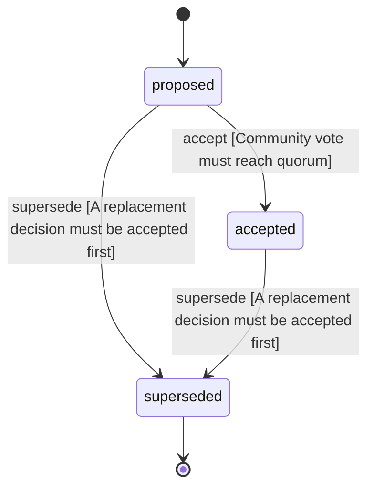

<!-- @generated by @newel/generator-wiki — do not edit -->
---
title: "FictionalMaterials"
---

# FictionalMaterials

`decision`

Fictional materials with unique properties replace real-world counterparts, giving the world consistent internal lore and design freedom.

> Decouple material design from real-world constraints while maintaining internal balance logic

## Attributes

| Field | Type | Description |
| ----- | ---- | ----------- |
| status | `proposed`, `accepted`, `superseded` |  |

## States

| State | Description |
| ----- | ----------- |
| `proposed` | Decision is under community discussion |
| `accepted` | Decision is ratified and in effect |
| `superseded` | Decision has been replaced by a newer decision |

## Actions

### accept

Ratify this decision after community review

**Conditions:**
- Community vote must reach quorum

### supersede

Mark this decision as replaced by a newer one

**Conditions:**
- A replacement decision must be accepted first

