<!-- @generated by @newel/generator-wiki — do not edit -->
---
title: "FieldRations"
---

# FieldRations

`item`

Dried grain-and-herb ration pack prepared from temperate grassland crops. Restores a modest amount of stamina and prevents hunger debuff for several in-game hours.

> Basic consumable food; encourages players to invest in agriculture as a supply chain

## Attributes

| Field | Type | Description |
| ----- | ---- | ----------- |
| condition | `pristine`, `worn`, `damaged`, `broken` |  |
| weight | decimal | kg per unit |
| rarity | `common`, `uncommon`, `rare`, `epic`, `legendary` |  |
| stackable | boolean | True; stacks up to 20 per slot |
| durability | integer | Freshness; hits 0 when spoiled |

## States

```mermaid
stateDiagram-v2
  [*] --> pristine
  pristine --> worn : degrade\n[Stored in a cold-cellar structure  degradation rate halved; When condition reaches broken the ration is spoiled and cannot be consumed]
  worn --> damaged : degrade\n[Stored in a cold-cellar structure  degradation rate halved; When condition reaches broken the ration is spoiled and cannot be consumed]
  damaged --> broken : degrade\n[Stored in a cold-cellar structure  degradation rate halved; When condition reaches broken the ration is spoiled and cannot be consumed]
  broken --> [*]
```

| State | Description |
| ----- | ----------- |
| `pristine` | Full potency or freshness; ready for use |
| `worn` | Reduced potency; still usable |
| `damaged` | Significantly degraded; use with caution |
| `broken` | Spoiled or fully depleted; cannot be used or repaired |

## Actions

### degrade

Food freshness degrades over real time

**Conditions:**
- Stored in a cold-cellar structure: degradation rate halved
- When condition reaches broken the ration is spoiled and cannot be consumed

