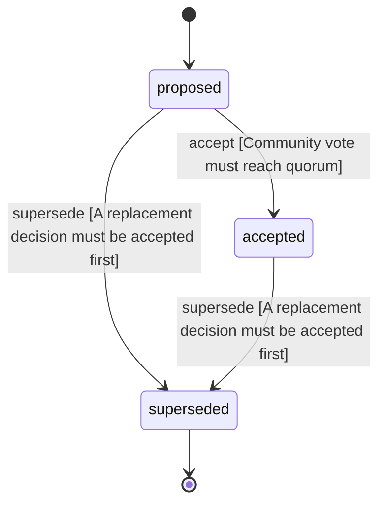

<!-- @generated by @newel/generator-wiki — do not edit -->
---
title: "GodotEngine"
---

# GodotEngine

`decision`

Use Godot 4.x as the game client engine. Chosen for its open-source license, GDScript ergonomics, and strong 3D/networking support.

> Lock in the client technology so all rendering, physics, and scripting work targets a single platform

## Attributes

| Field | Type | Description |
| ----- | ---- | ----------- |
| status | `proposed`, `accepted`, `superseded` |  |

## States

| State | Description |
| ----- | ----------- |
| `proposed` | Decision is under community discussion |
| `accepted` | Decision is ratified and in effect |
| `superseded` | Decision has been replaced by a newer decision |

## Actions

### accept

Ratify this decision after community review

**Conditions:**
- Community vote must reach quorum

### supersede

Mark this decision as replaced by a newer one

**Conditions:**
- A replacement decision must be accepted first

