<!-- @generated by @newel/generator-wiki — do not edit -->
---
title: "GovernanceSystem"
---

# GovernanceSystem

`world-system`

Defines the rules of in-game community governance. Players submit proposals, others vote, and a proposal ratifies only once a quorum of distinct voters has cast ballots within a voting window and a threshold fraction favour the change. The proposal author cannot vote on their own proposal.

> Ground the CommunityOwnsTheFuture principle in anti-gaming governance mechanics (quorum, window, no self-vote)

## Attributes

| Field | Type | Description |
| ----- | ---- | ----------- |
| ratification | json | Ratification parameters: threshold (fraction of cast votes that must favour), quorum (minimum distinct voters), windowSeconds (voting window before the proposal closes). |
| guildMinTier | string | Minimum Leadership tier required to form a guild |
| status | `proposed`, `accepted`, `superseded`, `expired` | Lifecycle of a proposal: open for voting, ratified, replaced, or lapsed past its window |

## States

```mermaid
stateDiagram-v2
  [*] --> proposed
  proposed --> accepted : ratify [The proposal author may not vote on their own proposal; Ratification requires at least quorum distinct voters; Votes after the voting window closes are rejected; A ratified proposal is recorded in the runtime decisions log]
  proposed --> expired : expire [A proposal past its window deadline transitions to expired; Expired proposals no longer accept votes]
  proposed --> superseded : supersede [A replacement proposal must be ratified first]
  accepted --> superseded : supersede [A replacement proposal must be ratified first]
  superseded --> [*]
  expired --> [*]
```

| State | Description |
| ----- | ----------- |
| `proposed` | Proposal is open for community voting within its window |
| `accepted` | Proposal ratified and recorded in the decisions log |
| `superseded` | Proposal replaced by a newer one |
| `expired` | Voting window lapsed without ratification |

## Actions

### ratify

Ratify a proposal that has met quorum, threshold, and window

**Conditions:**
- The proposal author may not vote on their own proposal
- Ratification requires at least quorum distinct voters
- Votes after the voting window closes are rejected
- A ratified proposal is recorded in the runtime decisions log

### expire

Close a proposal whose voting window has lapsed without ratification

**Conditions:**
- A proposal past its window deadline transitions to expired
- Expired proposals no longer accept votes

### supersede

Mark a proposal as replaced by a newer one

**Conditions:**
- A replacement proposal must be ratified first

