<!-- @generated by @newel/generator-wiki — do not edit -->
---
title: "GraywolfPack"
---

# GraywolfPack

`creature`

A coordinated hunting pack of gray wolves that roam temperate forest edges and clearings. Individual wolves are manageable; the pack tactics make them deadly to lone travellers. Taming a pup from a defeated pack unlocks the Ranger profession bonus.

> Introduce group AI tactics and the taming mechanic; reward skilled solo hunters over raw power

## Attributes

| Field | Type | Description |
| ----- | ---- | ----------- |
| state | `idle`, `alert`, `aggressive`, `fleeing`, `dead`, `respawning` |  |
| tier | `1`, `2`, `3`, `4`, `5` | Combat difficulty tier |
| aggressionLevel | `passive`, `neutral`, `aggressive`, `territorial` |  |
| baseHp | integer | Hit points per wolf at tier baseline |
| baseDamage | integer | Damage per bite at tier baseline |

## States

```mermaid
stateDiagram-v2
  [*] --> idle
  idle --> alert : detect [Lead wolf detects within 12 tile radius; pack shares the alert state instantly; Pack fires attack trigger directly from idle (no alert phase) if player is carrying raw meat]
  idle --> aggressive : detect [Lead wolf detects within 12 tile radius; pack shares the alert state instantly; Pack fires attack trigger directly from idle (no alert phase) if player is carrying raw meat]
  alert --> aggressive : attack [Two wolves attempt to flank; remaining wolves attack the front; Flanking wolf deals 1.5× baseDamage if attack lands from behind]
  alert --> idle : calm [Pack returns to patrol route 60 seconds after losing target]
  aggressive --> dead : die [Each wolf dies independently; pack is considered dead when all wolves reach the dead state]
  aggressive --> idle : calm [Pack returns to patrol route 60 seconds after losing target]
  alert --> fleeing : flee [Surviving wolves flee independently; they do not regroup during the same spawn cycle]
  aggressive --> fleeing : flee [Surviving wolves flee independently; they do not regroup during the same spawn cycle]
  fleeing --> dead : die [Each wolf dies independently; pack is considered dead when all wolves reach the dead state]
  fleeing --> idle : calm [Pack returns to patrol route 60 seconds after losing target]
  fleeing --> aggressive : attack [Two wolves attempt to flank; remaining wolves attack the front; Flanking wolf deals 1.5× baseDamage if attack lands from behind]
  dead --> respawning : respawn [Respawn cooldown 15 in-game minutes; pup does not respawn if tamed]
  respawning --> idle : calm [Pack returns to patrol route 60 seconds after losing target]
```

| State | Description |
| ----- | ----------- |
| `idle` | Creature is at rest; not pursuing any target |
| `alert` | Creature has detected a threat; preparing to fight or flee |
| `aggressive` | Creature is actively attacking a target |
| `fleeing` | Creature is retreating from danger; cannot attack |
| `dead` | Creature has been killed; drops are available |
| `respawning` | Creature is regenerating at its spawn point; not yet interactable |

## Actions

### detect

The lead wolf detects prey; pack transitions to alert simultaneously

**Conditions:**
- Lead wolf detects within 12 tile radius; pack shares the alert state instantly
- Pack fires attack trigger directly from idle (no alert phase) if player is carrying raw meat

### attack

Pack flanking attack — wolves surround the target and attack in sequence

**Conditions:**
- Two wolves attempt to flank; remaining wolves attack the front
- Flanking wolf deals 1.5× baseDamage if attack lands from behind

### flee

Pack disbands and flees when lead wolf is killed

**Conditions:**
- Surviving wolves flee independently; they do not regroup during the same spawn cycle

### die

Transition individual wolf (or full pack) to dead state; trigger loot drop

**Conditions:**
- Each wolf dies independently; pack is considered dead when all wolves reach the dead state

### drop

Drop loot when all wolves in the pack are dead

**Conditions:**
- Each wolf drops: wolf pelt (1), wolf fang (0–1, 40% chance)
- Pack alpha drop: alpha wolf fang (1, 100%)

### tame

Tame a surviving pup after defeating the alpha wolf

**Conditions:**
- Requires Unarmed: Journeyman
- Player must approach the pup while unarmed; pup is flagged tameable after alpha death
- Taming grants a wolf companion and sets the wolfBondHolder flag; Ranger profession requires this flag in addition to its skill prerequisites

### respawn

Pack reforms at its territory spawn point after cooldown

**Conditions:**
- Respawn cooldown: 15 in-game minutes; pup does not respawn if tamed

### calm

Return to idle when no prey is detected

**Conditions:**
- Pack returns to patrol route 60 seconds after losing target

