<!-- @generated by @newel/generator-wiki — do not edit -->
---
title: "Inventory"
---

# Inventory

`player`

The container of items carried by a single player. Weight and slot limits enforce the survival economy; exceeding either blocks pickups. Inventory contents are persisted server-side and restored on login.

> Define the rules governing what a player can carry, how items stack, and when the full state is reached

## Attributes

| Field | Type | Description |
| ----- | ---- | ----------- |
| state | `open`, `closed`, `full` |  |
| maxSlots | integer | Maximum number of distinct item stacks |
| maxWeightKg | decimal | Maximum total carry weight in kilograms |
| usedSlots | integer | Current number of occupied stacks |
| currentWeightKg | decimal | Sum of (item.weight × quantity) for all stacks |

## States

```mermaid
stateDiagram-v2
  [*] --> closed
  closed --> open : open [Blocked during combat animations; otherwise always permitted]
  open --> closed : close [Always permitted]
  open --> full : fill [Triggered automatically after every successful pickup that saturates either limit]
  closed --> full : fill [Triggered automatically after every successful pickup that saturates either limit]
  full --> open : open [Blocked during combat animations; otherwise always permitted]
  full --> closed : close [Always permitted]
```

| State | Description |
| ----- | ----------- |
| `open` | Inventory UI is visible; player can manage, equip, or drop items |
| `closed` | Inventory UI is hidden; passive weight and slot checks still apply |
| `full` | All slots and weight capacity are at maximum; pickups are rejected |

## Actions

### pickup

Add a world-dropped item to the inventory

**Conditions:**
- Rejected if state is full
- Stackable items merge into an existing stack if one exists; otherwise a new slot is consumed
- Weight is recalculated on every pickup; if the result would exceed maxWeightKg, the pickup is rejected
- Emits an item_picked_up event with the item id and quantity

### drop

Remove an item from the inventory and place it in the world at the player's position

**Conditions:**
- Dropping a full stack frees the slot
- Partial stack drop reduces quantity; slot is freed only when quantity reaches 0
- Equipment currently worn cannot be dropped without first being unequipped

### open

Open the inventory UI

**Conditions:**
- Blocked during combat animations; otherwise always permitted

### close

Close the inventory UI

**Conditions:**
- Always permitted

### fill

Transition to full state when slots or weight ceiling is reached

**Conditions:**
- Triggered automatically after every successful pickup that saturates either limit

