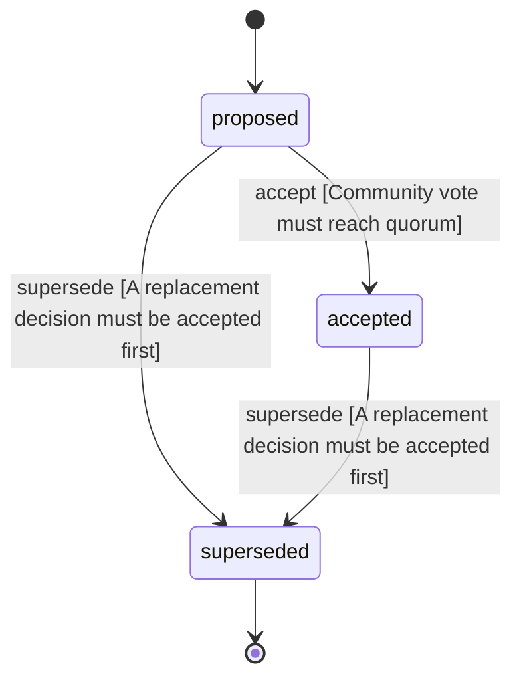

<!-- @generated by @newel/generator-wiki — do not edit -->
---
title: "KnowledgeByExperimentation"
---

# KnowledgeByExperimentation

`decision`

Knowledge is discovered through experimentation — recipes, materials, and world secrets are not handed to players via tooltips or vendors.

> Make the act of discovery a core progression mechanic, not a reward after grinding

## Attributes

| Field | Type | Description |
| ----- | ---- | ----------- |
| status | `proposed`, `accepted`, `superseded` |  |

## States

| State | Description |
| ----- | ----------- |
| `proposed` | Decision is under community discussion |
| `accepted` | Decision is ratified and in effect |
| `superseded` | Decision has been replaced by a newer decision |

## Actions

### accept

Ratify this decision after community review

**Conditions:**
- Community vote must reach quorum

### supersede

Mark this decision as replaced by a newer one

**Conditions:**
- A replacement decision must be accepted first

