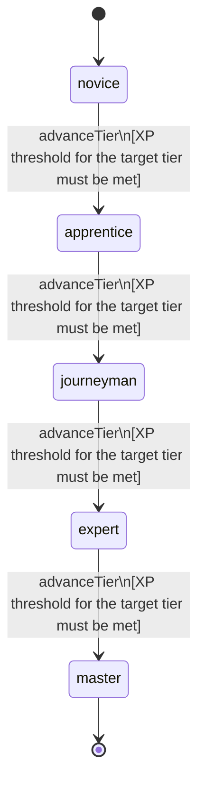

<!-- @generated by @newel/generator-wiki — do not edit -->
---
title: "Leadership"
---

# Leadership

`skill`

Inspiring and coordinating allies in combat and in civic roles. Grants persistent aura buffs to nearby party members and unlocks group command actions.

> Create a dedicated support-combat role that scales with group size

## Attributes

| Field | Type | Description |
| ----- | ---- | ----------- |
| tier | `novice`, `apprentice`, `journeyman`, `expert`, `master` |  |
| xpCurve | `linear`, `quadratic`, `exponential` | XP required per tier |
| maxLevel | integer | Maximum XP level within a tier before tier advance is required |
| category | `combat`, `crafting`, `magic`, `exploration`, `social` | Skill domain: social |

## States

| State | Description |
| ----- | ----------- |
| `novice` | Entry-level practitioner; basic techniques only |
| `apprentice` | Growing competence; intermediate techniques unlock |
| `journeyman` | Solid practitioner; advanced techniques and profession gates open |
| `expert` | Near-mastery; most advanced abilities available |
| `master` | Complete mastery; all abilities unlocked |

## Actions

### advanceTier

Progress to the next mastery tier through accumulated leadership XP

**Conditions:**
- XP threshold for the target tier must be met

### rallyParty

Issue a rally call that temporarily boosts movement speed for all nearby allies

**Conditions:**
- Requires Leadership: Apprentice

### commandFormation

Position up to 10 allies in a combat formation granting a shared defensive bonus

**Conditions:**
- Requires Leadership: Journeyman

### inspireBreakthrough

Deliver a rallying speech before a siege or major battle; grants all participants a temporary combat buff

**Conditions:**
- Requires Leadership: Expert

