<!-- @generated by @newel/generator-wiki — do not edit -->
---
title: "LootTable"
---

# LootTable

`loot`

Defines the rules that govern what items drop when a creature dies. Each entry specifies an item, a quantity range, and a drop chance. The LootTable is shared across all instances of a creature species; individual rolls are performed per kill by the loot system.

> Centralise drop rules in the design bible so balance changes are a single-source edit rather than scattered constants

## Attributes

| Field | Type | Description |
| ----- | ---- | ----------- |
| state | `sealed`, `available`, `claimed`, `expired` |  |
| creatureId | string | Entity key of the creature this table belongs to |
| despawnSeconds | integer | Seconds before unclaimed loot is removed from the world |

## States

```mermaid
stateDiagram-v2
  [*] --> sealed
  sealed --> available : roll [Guaranteed entries (chance = 1.0) always produce their item; Chance entries are rolled independently; multiple chance drops can occur in one kill; Quantity is chosen uniformly at random within [minQty, maxQty]; Rolled items are placed at the creature's death position as world pickups; Emits a loot_dropped event with the full drop list]
  available --> claimed : collect [Collection transfers the item to the player's inventory via Inventory.pickup; When the last item is collected the state transitions to claimed]
  available --> expired : expire [Timer starts when state enters available; Expiry emits a loot_expired event so clients can hide the pickup indicator]
  claimed --> expired : expire [Timer starts when state enters available; Expiry emits a loot_expired event so clients can hide the pickup indicator]
  expired --> [*]
```

| State | Description |
| ----- | ----------- |
| `sealed` | Loot has not yet been rolled; no items are visible |
| `available` | Loot roll has completed; items are present in the world and can be picked up |
| `claimed` | All items have been picked up; the container is empty |
| `expired` | Despawn timer elapsed with unclaimed items; items are removed from the world |

## Actions

### roll

Perform the loot roll for all entries in the table and place results in the world

**Conditions:**
- Guaranteed entries (chance = 1.0) always produce their item
- Chance entries are rolled independently; multiple chance drops can occur in one kill
- Quantity is chosen uniformly at random within [minQty, maxQty]
- Rolled items are placed at the creature's death position as world pickups
- Emits a loot_dropped event with the full drop list

### collect

A player picks up one or more items from the available loot

**Conditions:**
- Collection transfers the item to the player's inventory via Inventory.pickup
- When the last item is collected the state transitions to claimed

### expire

Despawn timer elapses; all remaining items are removed

**Conditions:**
- Timer starts when state enters available
- Expiry emits a loot_expired event so clients can hide the pickup indicator

