<!-- @generated by @newel/generator-wiki — do not edit -->
---
title: "Merchant"
---

# Merchant

`profession`

A commercial specialist who leverages trade acumen, diplomatic connections, and speechcraft to dominate NPC and player-to-NPC markets. Can operate offline via NPC consignment.

> Make commerce a viable primary profession; enable the player-driven economy to function at scale

## Attributes

| Field | Type | Description |
| ----- | ---- | ----------- |
| status | `locked`, `active`, `mastered` |  |

## Related

| Name | Kind | Target |
| ---- | ---- | ------ |
| trade | hasOne | [Trade](trade.md) |
| diplomacy | hasOne | [Diplomacy](diplomacy.md) |
| speechcraft | hasOne | [Speechcraft](speechcraft.md) |

## States

```mermaid
stateDiagram-v2
  [*] --> locked
  locked --> active : unlock [Requires Trade Journeyman; Requires Diplomacy Apprentice; Requires Speechcraft Apprentice]
  active --> mastered : master [Trade, Diplomacy, and Speechcraft must all be at master tier]
  mastered --> [*]
```

| State | Description |
| ----- | ----------- |
| `locked` | Prerequisite skill tiers not yet met |
| `active` | Profession is available to the player; provides passive and active bonuses |
| `mastered` | All constituent skills are at master tier; highest-tier profession bonuses active |

## Actions

### unlock

Become available when prerequisite social skill tiers are reached

**Conditions:**
- Requires Trade: Journeyman
- Requires Diplomacy: Apprentice
- Requires Speechcraft: Apprentice

### master

Achieve full mastery when all constituent skills reach master tier

**Conditions:**
- Trade, Diplomacy, and Speechcraft must all be at master tier

