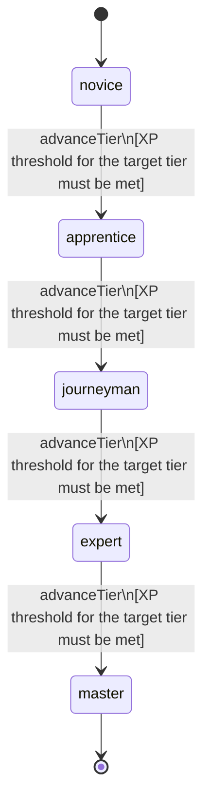

<!-- @generated by @newel/generator-wiki — do not edit -->
---
title: "Navigation"
---

# Navigation

`skill`

Wayfinding without landmarks using stars, moss growth, wind direction, and terrain features. Reduces travel time penalties in unmapped regions and enables leading groups efficiently.

> Make geography meaningful by rewarding players who invest in spatial knowledge

## Attributes

| Field | Type | Description |
| ----- | ---- | ----------- |
| tier | `novice`, `apprentice`, `journeyman`, `expert`, `master` |  |
| xpCurve | `linear`, `quadratic`, `exponential` | XP required per tier |
| maxLevel | integer | Maximum XP level within a tier before tier advance is required |
| category | `combat`, `crafting`, `magic`, `exploration`, `social` | Skill domain: exploration |

## States

| State | Description |
| ----- | ----------- |
| `novice` | Entry-level practitioner; basic techniques only |
| `apprentice` | Growing competence; intermediate techniques unlock |
| `journeyman` | Solid practitioner; advanced techniques and profession gates open |
| `expert` | Near-mastery; most advanced abilities available |
| `master` | Complete mastery; all abilities unlocked |

## Actions

### advanceTier

Progress to the next mastery tier through accumulated navigation XP

**Conditions:**
- XP threshold for the target tier must be met

### orientByStars

Determine cardinal direction and rough position from night-sky observations

**Conditions:**
- Requires Navigation: Apprentice

### plotOverlandRoute

Plan an efficient multi-biome route that avoids hazards and minimises travel time

**Conditions:**
- Requires Navigation: Journeyman

### leadExpedition

Guide a group of up to 10 players through unmapped terrain without travel penalty

**Conditions:**
- Requires Navigation: Expert

