<!-- @generated by @newel/generator-wiki — do not edit -->
---
title: "Pathfinder"
---

# Pathfinder

`profession`

An expert scout and guide who can navigate any terrain invisibly, chart it accurately, and lead groups at full speed. Essential for opening new territories.

> Reward deep exploration investment; create a profession that opens the world for other players

## Attributes

| Field | Type | Description |
| ----- | ---- | ----------- |
| status | `locked`, `active`, `mastered` |  |

## Related

| Name | Kind | Target |
| ---- | ---- | ------ |
| navigation | hasOne | [Navigation](navigation.md) |
| cartography | hasOne | [Cartography](cartography.md) |
| stealth | hasOne | [Stealth](stealth.md) |

## States

```mermaid
stateDiagram-v2
  [*] --> locked
  locked --> active : unlock\n[Requires Navigation  Journeyman; Requires Cartography  Journeyman; Requires Stealth  Apprentice]
  active --> mastered : master\n[Navigation, Cartography, and Stealth must all be at master tier]
  mastered --> [*]
```

| State | Description |
| ----- | ----------- |
| `locked` | Prerequisite skill tiers not yet met |
| `active` | Profession is available to the player; provides passive and active bonuses |
| `mastered` | All constituent skills are at master tier; highest-tier profession bonuses active |

## Actions

### unlock

Become available when prerequisite exploration skill tiers are reached

**Conditions:**
- Requires Navigation: Journeyman
- Requires Cartography: Journeyman
- Requires Stealth: Apprentice

### master

Achieve full mastery when all constituent skills reach master tier

**Conditions:**
- Navigation, Cartography, and Stealth must all be at master tier

