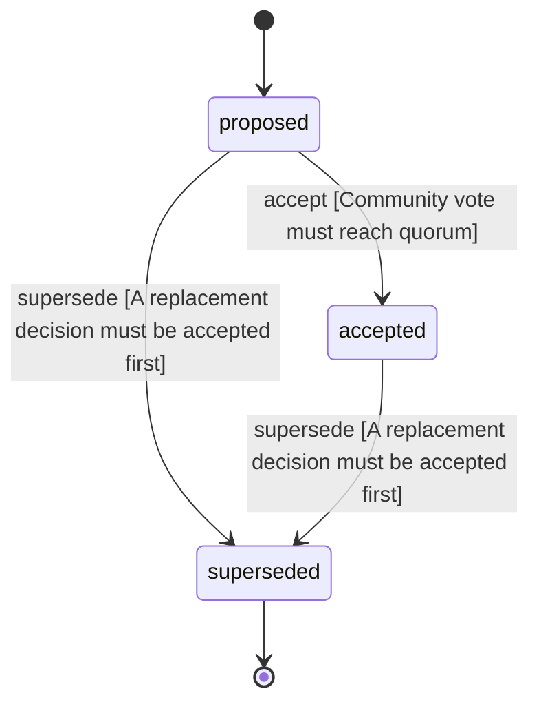

<!-- @generated by @newel/generator-wiki — do not edit -->
---
title: "PlayerIdentityModel"
---

# PlayerIdentityModel

`decision`

A player identity is a server-issued local UUID (player_id), not an account. The server mints the id on first join, persists it next to the player record, and sends it to the client so a reconnect re-binds to the same record. The client may present a cached id at join, and the server honours it only when it already owns that record and no live peer holds it — a client can therefore never claim another online player's record.

> Give every player a connection-independent identity so inventory, HP, position, and appearance survive a reconnect or a server restart, without waiting for an account/auth service

## Attributes

| Field | Type | Description |
| ----- | ---- | ----------- |
| status | `proposed`, `accepted`, `superseded` |  |

## States

| State | Description |
| ----- | ----------- |
| `proposed` | Decision is under community discussion |
| `accepted` | Decision is ratified and in effect |
| `superseded` | Decision has been replaced by a newer decision |

## Actions

### accept

Ratify this decision after community review

**Conditions:**
- Community vote must reach quorum

### supersede

Mark this decision as replaced by a newer one

**Conditions:**
- A replacement decision must be accepted first

