<!-- @generated by @newel/generator-wiki — do not edit -->
---
title: "Ranger"
---

# Ranger

`profession`

A wilderness specialist who combines ranged combat with reading the environment. Provides the most effective hunting output and can guide expeditions through unmapped terrain.

> Represent the hunting and wilderness-travel profession; bridge combat and exploration

## Attributes

| Field | Type | Description |
| ----- | ---- | ----------- |
| status | `locked`, `active`, `mastered` |  |

## Related

| Name | Kind | Target |
| ---- | ---- | ------ |
| archery | hasOne | [Archery](archery.md) |
| tracking | hasOne | [Tracking](tracking.md) |
| navigation | hasOne | [Navigation](navigation.md) |
| unarmed | hasOne | [Unarmed](unarmed.md) |

## States

```mermaid
stateDiagram-v2
  [*] --> locked
  locked --> active : unlock\n[Requires Archery  Journeyman; Requires Tracking  Apprentice; Requires Navigation  Apprentice; Player must hold wolfBondHolder flag — requires taming a GraywolfPack pup, which in turn requires Unarmed  Journeyman]
  active --> mastered : master\n[Archery, Tracking, Navigation, and Unarmed must all be at master tier]
  mastered --> [*]
```

| State | Description |
| ----- | ----------- |
| `locked` | Prerequisite skill tiers not yet met |
| `active` | Profession is available to the player; provides passive and active bonuses |
| `mastered` | All constituent skills are at master tier; highest-tier profession bonuses active |

## Actions

### unlock

Become available when prerequisite exploration and combat skill tiers are reached

**Conditions:**
- Requires Archery: Journeyman
- Requires Tracking: Apprentice
- Requires Navigation: Apprentice
- Player must hold wolfBondHolder flag — requires taming a GraywolfPack pup, which in turn requires Unarmed: Journeyman

### master

Achieve full mastery when all constituent skills reach master tier

**Conditions:**
- Archery, Tracking, Navigation, and Unarmed must all be at master tier

