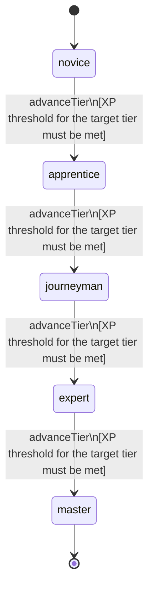

<!-- @generated by @newel/generator-wiki — do not edit -->
---
title: "RestorationMagic"
---

# RestorationMagic

`skill`

Healing, shielding, and cleansing magic. Operates on living targets and can purge negative status effects including minor void corruption.

> Enable a support-focused magic path that remains viable without offensive output

## Attributes

| Field | Type | Description |
| ----- | ---- | ----------- |
| tier | `novice`, `apprentice`, `journeyman`, `expert`, `master` |  |
| xpCurve | `linear`, `quadratic`, `exponential` | XP required per tier |
| maxLevel | integer | Maximum XP level within a tier before tier advance is required |
| category | `combat`, `crafting`, `magic`, `exploration`, `social` | Skill domain: magic |

## States

| State | Description |
| ----- | ----------- |
| `novice` | Entry-level practitioner; basic techniques only |
| `apprentice` | Growing competence; intermediate techniques unlock |
| `journeyman` | Solid practitioner; advanced techniques and profession gates open |
| `expert` | Near-mastery; most advanced abilities available |
| `master` | Complete mastery; all abilities unlocked |

## Actions

### advanceTier

Progress to the next mastery tier through accumulated restoration XP

**Conditions:**
- XP threshold for the target tier must be met

### castHeal

Restore a portion of a target's health pool

**Conditions:**
- Requires Restoration Magic: Apprentice

### castCleanse

Remove a negative status effect from a target; removes minor void corruption

**Conditions:**
- Requires Restoration Magic: Journeyman

### castRegenerationField

Create a pulsing area that heals all allies within it each tick

**Conditions:**
- Requires Restoration Magic: Expert

