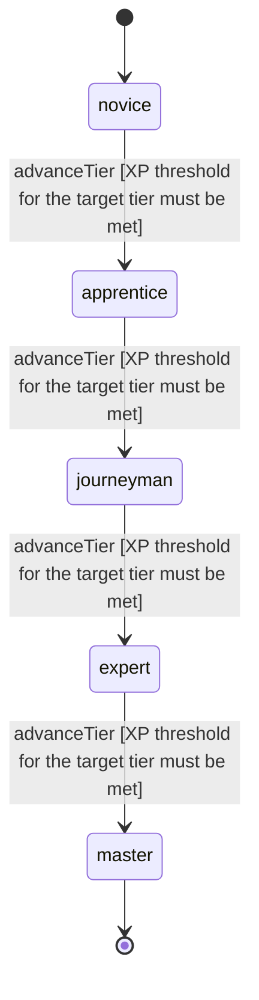

<!-- @generated by @newel/generator-wiki — do not edit -->
---
title: "Shieldcraft"
---

# Shieldcraft

`skill`

Techniques for using a shield offensively and defensively — blocking, parrying, bashing, and forming protective stances. Works with any shield material.

> Reward dedicated defenders and create a viable tank archetype

## Attributes

| Field | Type | Description |
| ----- | ---- | ----------- |
| tier | `novice`, `apprentice`, `journeyman`, `expert`, `master` |  |
| xpCurve | `linear`, `quadratic`, `exponential` | XP required per tier |
| maxLevel | integer | Maximum XP level within a tier before tier advance is required |
| category | `combat`, `crafting`, `magic`, `exploration`, `social` | Skill domain: combat |

## States

| State | Description |
| ----- | ----------- |
| `novice` | Entry-level practitioner; basic techniques only |
| `apprentice` | Growing competence; intermediate techniques unlock |
| `journeyman` | Solid practitioner; advanced techniques and profession gates open |
| `expert` | Near-mastery; most advanced abilities available |
| `master` | Complete mastery; all abilities unlocked |

## Actions

### advanceTier

Progress to the next mastery tier through accumulated defensive XP

**Conditions:**
- XP threshold for the target tier must be met

### executeParry

Time a block precisely to deflect an attack and create a counterattack window

**Conditions:**
- Requires Shieldcraft: Apprentice

### executeShieldBash

Strike with the shield to stun a target briefly and break their combo

**Conditions:**
- Requires Shieldcraft: Journeyman

### activateFortify

Enter a rooted defensive stance that dramatically reduces incoming damage

**Conditions:**
- Requires Shieldcraft: Expert

