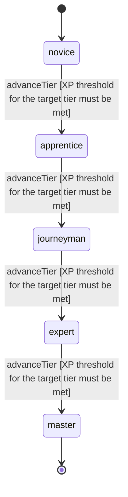

<!-- @generated by @newel/generator-wiki — do not edit -->
---
title: "Smithing"
---

# Smithing

`skill`

Metalworking at a forge — shaping ingots into weapons, armor, and structural components. Covers hammer technique, heat management, and alloy timing. Required for ferrite tools early-game and veilsteel gear mid-game.

> Gate weapon and armor quality behind craft investment; make forges worth building

## Attributes

| Field | Type | Description |
| ----- | ---- | ----------- |
| tier | `novice`, `apprentice`, `journeyman`, `expert`, `master` |  |
| xpCurve | `linear`, `quadratic`, `exponential` | XP required per tier |
| maxLevel | integer | Maximum XP level within a tier before tier advance is required |
| category | `combat`, `crafting`, `magic`, `exploration`, `social` | Skill domain: crafting |

## States

| State | Description |
| ----- | ----------- |
| `novice` | Entry-level practitioner; basic techniques only |
| `apprentice` | Growing competence; intermediate techniques unlock |
| `journeyman` | Solid practitioner; advanced techniques and profession gates open |
| `expert` | Near-mastery; most advanced abilities available |
| `master` | Complete mastery; all abilities unlocked |

## Actions

### advanceTier

Progress to the next mastery tier through accumulated smithing XP

**Conditions:**
- XP threshold for the target tier must be met

### craftBasicWeapon

Forge a basic ferrite tool or weapon at a standard forge

**Conditions:**
- Requires Smithing: Novice

### craftAlloyIngot

Produce a veilsteel ingot by alloying ferrite and aethermite in a master forge

**Conditions:**
- Requires Smithing: Journeyman

### craftMasterwork

Apply masterwork techniques to improve item base stats beyond standard rolls

**Conditions:**
- Requires Smithing: Expert

