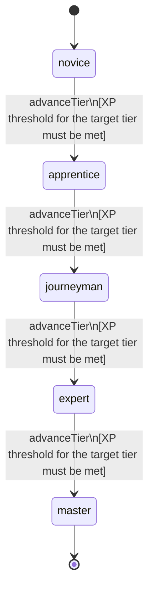

<!-- @generated by @newel/generator-wiki — do not edit -->
---
title: "Speechcraft"
---

# Speechcraft

`skill`

Persuasion, intimidation, and deception aimed at NPC targets. Can unlock hidden dialogue options, reduce hostility, or extract information from NPCs.

> Enable a social manipulation path; prevent combat from being the only solution to NPC obstacles

## Attributes

| Field | Type | Description |
| ----- | ---- | ----------- |
| tier | `novice`, `apprentice`, `journeyman`, `expert`, `master` |  |
| xpCurve | `linear`, `quadratic`, `exponential` | XP required per tier |
| maxLevel | integer | Maximum XP level within a tier before tier advance is required |
| category | `combat`, `crafting`, `magic`, `exploration`, `social` | Skill domain: social |

## States

| State | Description |
| ----- | ----------- |
| `novice` | Entry-level practitioner; basic techniques only |
| `apprentice` | Growing competence; intermediate techniques unlock |
| `journeyman` | Solid practitioner; advanced techniques and profession gates open |
| `expert` | Near-mastery; most advanced abilities available |
| `master` | Complete mastery; all abilities unlocked |

## Actions

### advanceTier

Progress to the next mastery tier through accumulated speechcraft XP

**Conditions:**
- XP threshold for the target tier must be met

### convinceNpc

Persuade an NPC to comply with a request using reasoned argument

**Conditions:**
- Requires Speechcraft: Apprentice

### intimidateNpc

Compel an NPC through veiled or direct threat; risks reputation damage on failure

**Conditions:**
- Requires Speechcraft: Journeyman

### deceiveNpc

Plant false information with an NPC to redirect their behaviour

**Conditions:**
- Requires Speechcraft: Expert

