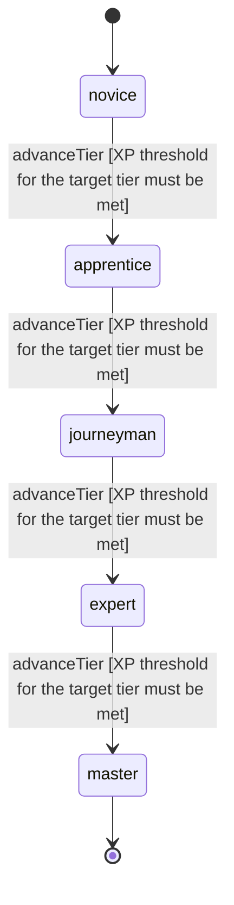

<!-- @generated by @newel/generator-wiki — do not edit -->
---
title: "Stealth"
---

# Stealth

`skill`

Moving, hiding, and acting without detection. Affects footstep volume, trail signature, and enemy detection radius. Higher tiers enable sustained stealth while performing actions.

> Create a viable non-combat exploration and infiltration path

## Attributes

| Field | Type | Description |
| ----- | ---- | ----------- |
| tier | `novice`, `apprentice`, `journeyman`, `expert`, `master` |  |
| xpCurve | `linear`, `quadratic`, `exponential` | XP required per tier |
| maxLevel | integer | Maximum XP level within a tier before tier advance is required |
| category | `combat`, `crafting`, `magic`, `exploration`, `social` | Skill domain: exploration |

## States

| State | Description |
| ----- | ----------- |
| `novice` | Entry-level practitioner; basic techniques only |
| `apprentice` | Growing competence; intermediate techniques unlock |
| `journeyman` | Solid practitioner; advanced techniques and profession gates open |
| `expert` | Near-mastery; most advanced abilities available |
| `master` | Complete mastery; all abilities unlocked |

## Actions

### advanceTier

Progress to the next mastery tier through accumulated stealth XP

**Conditions:**
- XP threshold for the target tier must be met

### activateCrouchHide

Enter a stationary hiding state that reduces detection radius significantly

**Conditions:**
- Requires Stealth: Apprentice

### activateShadowMove

Move at half speed while remaining hidden — trail signature is fully suppressed

**Conditions:**
- Requires Stealth: Journeyman

### executeSilentAction

Perform an interaction — opening a container, looting — without breaking stealth

**Conditions:**
- Requires Stealth: Expert

