<!-- @generated by @newel/generator-wiki — do not edit -->
---
title: "SteppeBison"
---

# SteppeBison

`creature`

A massive, shaggy bison that grazes temperate grasslands in loose herds. Slow and passive unless provoked, but a stampede is lethal to unarmoured players. The primary large-game target for grassland settlements; bones are a key structural component.

> Provide a high-yield, high-risk hunt that rewards group play and rewarded preparation

## Attributes

| Field | Type | Description |
| ----- | ---- | ----------- |
| state | `idle`, `alert`, `aggressive`, `fleeing`, `dead`, `respawning` |  |
| tier | `1`, `2`, `3`, `4`, `5` | Combat difficulty tier |
| aggressionLevel | `passive`, `neutral`, `aggressive`, `territorial` |  |
| baseHp | integer | Hit points at tier baseline; high value |
| baseDamage | integer | Damage per charge at tier baseline |

## States

```mermaid
stateDiagram-v2
  [*] --> idle
  idle --> alert : detect\n[Detects vibration (galloping horses, explosions) within 20 tiles; Scent detection within 6 tiles regardless of stealth skill]
  alert --> aggressive : attack\n[Charge deals 3× baseDamage to first target in path; 1× to any behind; Charge cannot be performed on uphill terrain]
  alert --> idle : calm\n[Returns to idle 2 in-game minutes after losing threat]
  aggressive --> dead : die\n[Emits a death event; surviving herd members do not reset their flee state until cooldown expires]
  aggressive --> idle : calm\n[Returns to idle 2 in-game minutes after losing threat]
  alert --> fleeing : flee\n[Entire herd flees together; players caught in stampede path take 2× baseDamage per second; Fleeing direction is always away from the original threat source]
  aggressive --> fleeing : flee\n[Entire herd flees together; players caught in stampede path take 2× baseDamage per second; Fleeing direction is always away from the original threat source]
  fleeing --> dead : die\n[Emits a death event; surviving herd members do not reset their flee state until cooldown expires]
  fleeing --> idle : calm\n[Returns to idle 2 in-game minutes after losing threat]
  fleeing --> aggressive : attack\n[Charge deals 3× baseDamage to first target in path; 1× to any behind; Charge cannot be performed on uphill terrain]
  dead --> respawning : respawn\n[Respawn cooldown  20 in-game minutes; herd respawns as a group]
  respawning --> idle : calm\n[Returns to idle 2 in-game minutes after losing threat]
```

| State | Description |
| ----- | ----------- |
| `idle` | Creature is at rest; not pursuing any target |
| `alert` | Creature has detected a threat; preparing to fight or flee |
| `aggressive` | Creature is actively attacking a target |
| `fleeing` | Creature is retreating from danger; cannot attack |
| `dead` | Creature has been killed; drops are available |
| `respawning` | Creature is regenerating at its spawn point; not yet interactable |

## Actions

### detect

Sense a threat through ground vibration and scent

**Conditions:**
- Detects vibration (galloping horses, explosions) within 20 tiles
- Scent detection within 6 tiles regardless of stealth skill

### attack

Stampede charge in a straight line through the target

**Conditions:**
- Charge deals 3× baseDamage to first target in path; 1× to any behind
- Charge cannot be performed on uphill terrain

### flee

Herd stampedes away from threat, dangerous to nearby players

**Conditions:**
- Entire herd flees together; players caught in stampede path take 2× baseDamage per second
- Fleeing direction is always away from the original threat source

### die

Transition to dead state; trigger loot drop and start respawn timer

**Conditions:**
- Emits a death event; surviving herd members do not reset their flee state until cooldown expires

### drop

Drop loot on death

**Conditions:**
- Always drops: bison meat (3–6), bison hide (2), bison bone (1–2)
- Chance drop: bison horn (25%)

### respawn

Respawn at the herd centre point after cooldown

**Conditions:**
- Respawn cooldown: 20 in-game minutes; herd respawns as a group

### calm

Herd settles back to grazing after threat passes

**Conditions:**
- Returns to idle 2 in-game minutes after losing threat

