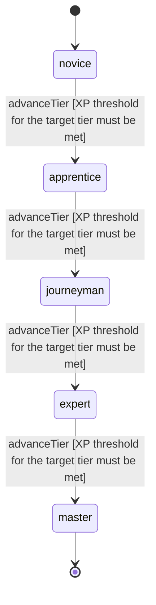

<!-- @generated by @newel/generator-wiki — do not edit -->
---
title: "Swordsmanship"
---

# Swordsmanship

`skill`

Mastery of bladed weapons — from crude ferrite daggers to enchanted veilsteel longswords. Covers footwork, swing mechanics, and dueling composure.

> Gate melee combat power behind practiced investment

## Attributes

| Field | Type | Description |
| ----- | ---- | ----------- |
| tier | `novice`, `apprentice`, `journeyman`, `expert`, `master` |  |
| xpCurve | `linear`, `quadratic`, `exponential` | XP required per tier |
| maxLevel | integer | Maximum XP level within a tier before tier advance is required |
| category | `combat`, `crafting`, `magic`, `exploration`, `social` | Skill domain: combat |

## States

| State | Description |
| ----- | ----------- |
| `novice` | Entry-level practitioner; basic techniques only |
| `apprentice` | Growing competence; intermediate techniques unlock |
| `journeyman` | Solid practitioner; advanced techniques and profession gates open |
| `expert` | Near-mastery; most advanced abilities available |
| `master` | Complete mastery; all abilities unlocked |

## Actions

### advanceTier

Progress to the next mastery tier through accumulated combat XP

**Conditions:**
- XP threshold for the target tier must be met

### executePowerStrike

Land a heavy blow that deals bonus damage and staggers the target

**Conditions:**
- Requires Swordsmanship: Apprentice

### executeCounterSlash

Exploit an enemy opening after a successful dodge to deal a precision strike

**Conditions:**
- Requires Swordsmanship: Journeyman

### executeWhirlwindBlade

Spin attack hitting all adjacent enemies simultaneously; high stamina cost

**Conditions:**
- Requires Swordsmanship: Expert

