<!-- @generated by @newel/generator-wiki — do not edit -->
---
title: "TechArcaneForging"
---

# TechArcaneForging

`technology`

Magical metallurgy principles. Unlocks the arcane forge structure and all arcane crafting recipes including aethermite shard imbuing and the aethermite bow.

> Bridge technology linking the smithing and magic trees; requires both paths to unlock

## Attributes

| Field | Type | Description |
| ----- | ---- | ----------- |
| status | `locked`, `researching`, `unlocked` |  |
| researchCost | integer | Research points required to complete |
| tier | integer | Technology tree tier |

## Related

| Name | Kind | Target |
| ---- | ---- | ------ |
| requiresTechBasicSmithing | hasOne | [TechBasicSmithing](techbasicsmithing.md) |
| requiresTechAlchemy | hasOne | [TechAlchemy](techalchemy.md) |
| unlocksRecipeEnchantedAethermiteShard | hasOne | [RecipeEnchantedAethermiteShard](recipeenchantedaethermiteshard.md) |
| unlocksRecipeAethermiteBow | hasOne | [RecipeAethermiteBow](recipeaethermitebow.md) |
| unlocksRecipeLumenfiteOrb | hasOne | [RecipeLumenfiteOrb](recipelumenfiteorb.md) |

## States

```mermaid
stateDiagram-v2
  [*] --> locked
  locked --> researching : beginResearch [Requires TechBasicSmithing unlocked; Requires TechAlchemy unlocked; Requires Arcane Forging Apprentice]
  researching --> unlocked : completeResearch [Research cost fully paid]
  unlocked --> [*]
```

| State | Description |
| ----- | ----------- |
| `locked` | Prerequisites not yet met; technology is not visible in the research interface |
| `researching` | Player or guild has committed resources; research progresses over time |
| `unlocked` | Research complete; all associated recipes and abilities are available |

## Actions

### beginResearch

Commit resources to arcane forging research

**Conditions:**
- Requires TechBasicSmithing: unlocked
- Requires TechAlchemy: unlocked
- Requires Arcane Forging: Apprentice

### completeResearch

Finish research; arcane forge blueprint and arcane recipes become available

**Conditions:**
- Research cost fully paid

