<!-- @generated by @newel/generator-wiki — do not edit -->
---
title: "TechBasicCarpentry"
---

# TechBasicCarpentry

`technology`

Foundation woodworking knowledge. Unlocks the carpentry bench, plank milling, and basic wood-component recipes.

> Root node of the carpentry tree; parallel to basic smithing for wood-primary builds

## Attributes

| Field | Type | Description |
| ----- | ---- | ----------- |
| status | `locked`, `researching`, `unlocked` |  |
| researchCost | integer | Research points required to complete |
| tier | integer | Technology tree tier (1 = root) |
| tech | json | Structured technology data: recipe unlocks, prerequisite technologies, research duration (seconds), and material cost consumed to begin research. |

## Related

| Name | Kind | Target |
| ---- | ---- | ------ |
| unlocksRecipeThornwoodPlank | hasOne | [RecipeThornwoodPlank](recipethornwoodplank.md) |
| unlocksRecipeCarpenterAxe | hasOne | [RecipeCarpenterAxe](recipecarpenteraxe.md) |

## States

```mermaid
stateDiagram-v2
  [*] --> locked
  locked --> researching : beginResearch [No prerequisites; requires a stockpile of thornwood logs]
  researching --> unlocked : completeResearch [Research cost fully paid]
  unlocked --> [*]
```

| State | Description |
| ----- | ----------- |
| `locked` | Prerequisites not yet met; technology is not visible in the research interface |
| `researching` | Player or guild has committed resources; research progresses over time |
| `unlocked` | Research complete; all associated recipes and abilities are available |

## Actions

### beginResearch

Commit resources to basic carpentry research

**Conditions:**
- No prerequisites; requires a stockpile of thornwood logs

### completeResearch

Finish research and unlock carpentry bench blueprint and wood recipes

**Conditions:**
- Research cost fully paid

