<!-- @generated by @newel/generator-wiki — do not edit -->
---
title: "TechBasicSmithing"
---

# TechBasicSmithing

`technology`

Foundational metalworking knowledge. Unlocks the forge structure, ferrite smelting, and all Smithing: Novice recipes. Every civilization needs this first.

> Root node of the smithing tree; accessible to all players from the opening hours

## Attributes

| Field | Type | Description |
| ----- | ---- | ----------- |
| status | `locked`, `researching`, `unlocked` |  |
| researchCost | integer | Research points required to complete |
| tier | integer | Technology tree tier (1 = root) |

## Related

| Name | Kind | Target |
| ---- | ---- | ------ |
| unlocksRecipeFerriteIngot | hasOne | [RecipeFerriteIngot](recipeferriteingot.md) |
| unlocksRecipeFerriteShortSword | hasOne | [RecipeFerriteShortSword](recipeferriteshortsword.md) |
| unlocksRecipeFerritePick | hasOne | [RecipeFerritePick](recipeferritepick.md) |

## States

```mermaid
stateDiagram-v2
  [*] --> locked
  locked --> researching : beginResearch\n[No prerequisites required; Research requires a campfire or forge in the player's settlement]
  researching --> unlocked : completeResearch\n[Research cost fully paid; all related recipes become craftable]
  unlocked --> [*]
```

| State | Description |
| ----- | ----------- |
| `locked` | Prerequisites not yet met; technology is not visible in the research interface |
| `researching` | Player or guild has committed resources; research progresses over time |
| `unlocked` | Research complete; all associated recipes and abilities are available |

## Actions

### beginResearch

Commit resources to researching basic smithing

**Conditions:**
- No prerequisites required
- Research requires a campfire or forge in the player's settlement

### completeResearch

Finish research and unlock all basic smithing recipes

**Conditions:**
- Research cost fully paid; all related recipes become craftable

