<!-- @generated by @newel/generator-wiki — do not edit -->
---
title: "TechTextileWeaving"
---

# TechTextileWeaving

`technology`

Fiber processing and loom construction techniques. Unlocks duskfiber weaving and the cloak recipe. Depends on basic carpentry for the loom frame.

> Textile branch of carpentry tree; enables light-armour and stealth-build gear

## Attributes

| Field | Type | Description |
| ----- | ---- | ----------- |
| status | `locked`, `researching`, `unlocked` |  |
| researchCost | integer | Research points required to complete |
| tier | integer | Technology tree tier |
| tech | json | Structured technology data: recipe unlocks, prerequisite technologies, research duration (seconds), and material cost consumed to begin research. |

## Related

| Name | Kind | Target |
| ---- | ---- | ------ |
| requiresTechBasicCarpentry | hasOne | [TechBasicCarpentry](techbasiccarpentry.md) |
| unlocksRecipeDuskfiberCloak | hasOne | [RecipeDuskfiberCloak](recipeduskfibercloak.md) |

## States

```mermaid
stateDiagram-v2
  [*] --> locked
  locked --> researching : beginResearch [Requires TechBasicCarpentry unlocked; Requires a duskfiber supply (Twilight Grove access)]
  researching --> unlocked : completeResearch [Research cost fully paid]
  unlocked --> [*]
```

| State | Description |
| ----- | ----------- |
| `locked` | Prerequisites not yet met; technology is not visible in the research interface |
| `researching` | Player or guild has committed resources; research progresses over time |
| `unlocked` | Research complete; all associated recipes and abilities are available |

## Actions

### beginResearch

Commit resources to textile weaving research

**Conditions:**
- Requires TechBasicCarpentry: unlocked
- Requires a duskfiber supply (Twilight Grove access)

### completeResearch

Finish research; loom blueprint and duskfiber recipes become available

**Conditions:**
- Research cost fully paid

