<!-- @generated by @newel/generator-wiki — do not edit -->
---
title: "TechVoidMastery"
---

# TechVoidMastery

`technology`

Esoteric void-smithing and void-brewing techniques. Unlocks void-resist potion brewing and the void rune tablet recipe. Cannot be discovered through normal research — it is reverse-engineered from surviving void exposure.

> Endgame technology node; forces players to risk void-biome exploration before this branch opens

## Attributes

| Field | Type | Description |
| ----- | ---- | ----------- |
| status | `locked`, `researching`, `unlocked` |  |
| researchCost | integer | Research points required to complete |
| tier | integer | Technology tree tier (highest) |

## Related

| Name | Kind | Target |
| ---- | ---- | ------ |
| requiresTechArcaneForging | hasOne | [TechArcaneForging](techarcaneforging.md) |
| requiresTechAlchemy | hasOne | [TechAlchemy](techalchemy.md) |
| unlocksRecipeVoidResistPotion | hasOne | [RecipeVoidResistPotion](recipevoidresistpotion.md) |
| unlocksRecipeVoidRuneTablet | hasOne | [RecipeVoidRuneTablet](recipevoidrunetablet.md) |

## States

```mermaid
stateDiagram-v2
  [*] --> locked
  locked --> researching : beginResearch [Requires TechArcaneForging unlocked; Requires TechAlchemy unlocked; Player must hold voidBurstSurvivor flag; Cannot be initiated from a research interface — begins automatically on first successful Voidite.refine]
  researching --> unlocked : completeResearch [Research cost fully paid; The VoidTouched profession is required to use the unlocked recipes]
  unlocked --> [*]
```

| State | Description |
| ----- | ----------- |
| `locked` | Prerequisites not yet met; technology is not visible in the research interface |
| `researching` | Player or guild has committed resources; research progresses over time |
| `unlocked` | Research complete; all associated recipes and abilities are available |

## Actions

### beginResearch

Begin reverse-engineering void techniques after direct void exposure

**Conditions:**
- Requires TechArcaneForging: unlocked
- Requires TechAlchemy: unlocked
- Player must hold voidBurstSurvivor flag
- Cannot be initiated from a research interface — begins automatically on first successful Voidite.refine

### completeResearch

Finish void mastery research; void-tier recipes become available

**Conditions:**
- Research cost fully paid
- The VoidTouched profession is required to use the unlocked recipes

