<!-- @generated by @newel/generator-wiki — do not edit -->
---
title: "ThornwoodPlank"
---

# ThornwoodPlank

`item`

Rough-cut plank milled from thornwood logs. Primary construction and crafting lumber; used in furniture, workshop frames, bows, handles, and basic structures.

> Primary wood component; creates a lumber supply chain from Temperate Forest biomes

## Attributes

| Field | Type | Description |
| ----- | ---- | ----------- |
| condition | `pristine`, `worn`, `damaged`, `broken` |  |
| weight | decimal | kg per plank |
| rarity | `common`, `uncommon`, `rare`, `epic`, `legendary` |  |
| stackable | boolean | True; stacks up to 30 per slot |
| durability | integer | Structural integrity |

## Related

| Name | Kind | Target |
| ---- | ---- | ------ |
| thornwood | hasOne | [Thornwood](thornwood.md) |

## States

```mermaid
stateDiagram-v2
  [*] --> pristine
  pristine --> worn : degrade\n[Planks stored indoors or in a covered workshop do not degrade]
  worn --> damaged : degrade\n[Planks stored indoors or in a covered workshop do not degrade]
  damaged --> broken : degrade\n[Planks stored indoors or in a covered workshop do not degrade]
  broken --> pristine : repair\n[Requires Carpentry  Novice; no additional materials consumed]
  damaged --> pristine : repair\n[Requires Carpentry  Novice; no additional materials consumed]
  worn --> pristine : repair\n[Requires Carpentry  Novice; no additional materials consumed]
```

| State | Description |
| ----- | ----------- |
| `pristine` | Freshly crafted or repaired; full stat effectiveness |
| `worn` | Showing use; minor stat penalties apply |
| `damaged` | Significantly degraded; notable stat penalties; repair strongly advised |
| `broken` | Unusable; must be repaired at a workshop before use |

## Actions

### degrade

Plank degrades when exposed to rain without shelter or used in a damaged structure

**Conditions:**
- Planks stored indoors or in a covered workshop do not degrade

### repair

Plane and re-treat warped planks at a carpentry bench

**Conditions:**
- Requires Carpentry: Novice; no additional materials consumed

