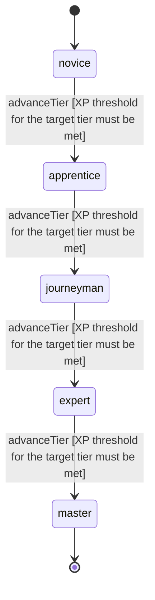

<!-- @generated by @newel/generator-wiki — do not edit -->
---
title: "Tracking"
---

# Tracking

`skill`

Reading environmental signs — footprints, disturbed foliage, scent trails — to follow creatures or players across terrain. Higher tiers identify creature type, size, and age of trail.

> Enable hunting professions and make the world feel inhabited and readable

## Attributes

| Field | Type | Description |
| ----- | ---- | ----------- |
| tier | `novice`, `apprentice`, `journeyman`, `expert`, `master` |  |
| xpCurve | `linear`, `quadratic`, `exponential` | XP required per tier |
| maxLevel | integer | Maximum XP level within a tier before tier advance is required |
| category | `combat`, `crafting`, `magic`, `exploration`, `social` | Skill domain: exploration |

## States

| State | Description |
| ----- | ----------- |
| `novice` | Entry-level practitioner; basic techniques only |
| `apprentice` | Growing competence; intermediate techniques unlock |
| `journeyman` | Solid practitioner; advanced techniques and profession gates open |
| `expert` | Near-mastery; most advanced abilities available |
| `master` | Complete mastery; all abilities unlocked |

## Actions

### advanceTier

Progress to the next mastery tier through accumulated tracking XP

**Conditions:**
- XP threshold for the target tier must be met

### identifyTrail

Determine the species and rough size of a creature from tracks

**Conditions:**
- Requires Tracking: Apprentice

### ageTrail

Estimate how recently a trail was made to determine whether prey is near

**Conditions:**
- Requires Tracking: Journeyman

### detectConcealedTrail

Uncover Stealth-obscured movement trails left by other players

**Conditions:**
- Requires Tracking: Expert

