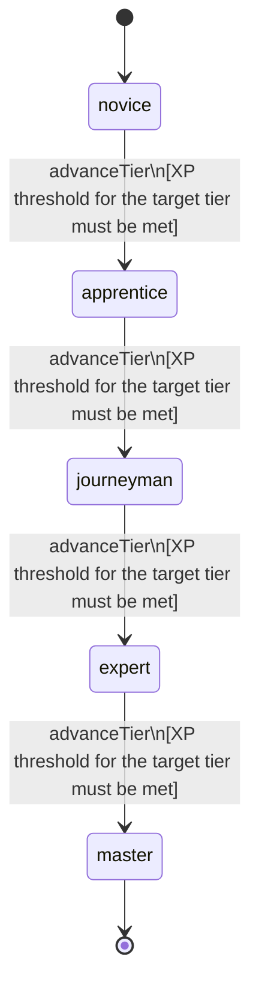

<!-- @generated by @newel/generator-wiki — do not edit -->
---
title: "Trade"
---

# Trade

`skill`

Commercial acumen that improves buy/sell spreads with NPC vendors and enables merchant-tier operations like bulk deals, consignment, and market stalls.

> Reward commercial specialisation; make player economy roles viable and distinct from combat roles

## Attributes

| Field | Type | Description |
| ----- | ---- | ----------- |
| tier | `novice`, `apprentice`, `journeyman`, `expert`, `master` |  |
| xpCurve | `linear`, `quadratic`, `exponential` | XP required per tier |
| maxLevel | integer | Maximum XP level within a tier before tier advance is required |
| category | `combat`, `crafting`, `magic`, `exploration`, `social` | Skill domain: social |

## States

| State | Description |
| ----- | ----------- |
| `novice` | Entry-level practitioner; basic techniques only |
| `apprentice` | Growing competence; intermediate techniques unlock |
| `journeyman` | Solid practitioner; advanced techniques and profession gates open |
| `expert` | Near-mastery; most advanced abilities available |
| `master` | Complete mastery; all abilities unlocked |

## Actions

### advanceTier

Progress to the next mastery tier through accumulated trade XP

**Conditions:**
- XP threshold for the target tier must be met

### operateMarketStall

Set up a persistent player-run market stall at a settlement location

**Conditions:**
- Requires Trade: Apprentice

### executeBulkDeal

Negotiate a high-volume transaction with an NPC faction at reduced unit price

**Conditions:**
- Requires Trade: Journeyman

### establishConsignment

Place goods with an NPC vendor on commission; vendor sells while player is offline

**Conditions:**
- Requires Trade: Expert

