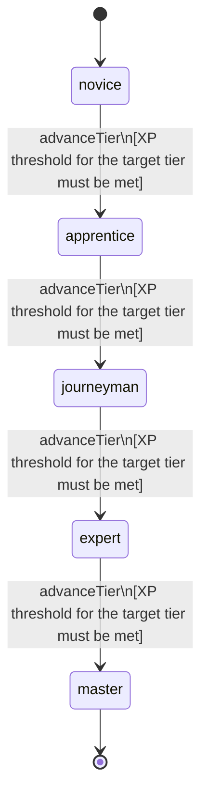

<!-- @generated by @newel/generator-wiki — do not edit -->
---
title: "Unarmed"
---

# Unarmed

`skill`

Hand-to-hand fighting techniques including strikes, grapples, and throws. Effective for disarming opponents and operating in no-weapon zones.

> Provide a no-equipment combat path and enable creature-taming interactions

## Attributes

| Field | Type | Description |
| ----- | ---- | ----------- |
| tier | `novice`, `apprentice`, `journeyman`, `expert`, `master` |  |
| xpCurve | `linear`, `quadratic`, `exponential` | XP required per tier |
| maxLevel | integer | Maximum XP level within a tier before tier advance is required |
| category | `combat`, `crafting`, `magic`, `exploration`, `social` | Skill domain: combat |

## States

| State | Description |
| ----- | ----------- |
| `novice` | Entry-level practitioner; basic techniques only |
| `apprentice` | Growing competence; intermediate techniques unlock |
| `journeyman` | Solid practitioner; advanced techniques and profession gates open |
| `expert` | Near-mastery; most advanced abilities available |
| `master` | Complete mastery; all abilities unlocked |

## Actions

### advanceTier

Progress to the next mastery tier through accumulated close-combat XP

**Conditions:**
- XP threshold for the target tier must be met

### executeDisarm

Strike the weapon arm to force an enemy to drop their equipped weapon

**Conditions:**
- Requires Unarmed: Apprentice

### executeGrapple

Seize a target and pin them, preventing movement for several seconds

**Conditions:**
- Requires Unarmed: Journeyman

### executeKnockdown

Throw a target to the ground, leaving them prone and vulnerable

**Conditions:**
- Requires Unarmed: Expert

