<!-- @generated by @newel/generator-wiki — do not edit -->
---
title: "VeilStalker"
---

# VeilStalker

`creature`

A lithe, shadowy predator that phases in and out of visibility in sync with the Twilight Grove's erratic light cycle. Hunts in silence, telegraphing its attack only by a brief luminescent pulse. Highly prized by alchemists — its venom is the base for the most potent paralytic compounds.

> Challenge experienced players with a visibility-mechanic fight and reward knowledge-based preparation

## Attributes

| Field | Type | Description |
| ----- | ---- | ----------- |
| state | `idle`, `alert`, `aggressive`, `fleeing`, `dead`, `respawning` |  |
| tier | `1`, `2`, `3`, `4`, `5` | Combat difficulty tier |
| aggressionLevel | `passive`, `neutral`, `aggressive`, `territorial` |  |
| baseHp | integer | Hit points at tier baseline |
| baseDamage | integer | Damage per strike at tier baseline |
| alertRadius | decimal | Distance in metres at which creature enters alert state |
| attackRadius | decimal | Distance in metres at which creature begins attacking |
| fleeThreshold | decimal | HP fraction (0–1) below which creature flees |
| respawnSeconds | integer | Seconds before a dead creature respawns |
| spawnCount | integer | Number of instances spawned per game world |
| biome | `TemperateForest`, `TemperateGrassland`, `VolcanicBadlands`, `TwilightGrove`, `VoidRift` | Biome this creature belongs to |
| drops | json | Structured drop table: raw drop item key, drop chance (0–1), and quantity range [minQty, maxQty]. Rolled independently per kill by the loot system. |

## States

```mermaid
stateDiagram-v2
  [*] --> idle
  idle --> alert : detect [Invisible while idle and alert; visibility phase lasts 1 second before each attack; Detects players within 15 tiles; follows silently before initiating attack; Tracking Expert can reveal a VeilStalker's approximate location via disturbed undergrowth]
  alert --> aggressive : attack [Deals baseDamage; injects venom on hit — venom causes paralysis (3 seconds, 20% chance); Paralysis prevents movement and action; does not stack; Must become visible for 1 second before striking; players can react during this window]
  alert --> idle : calm [Disengages and becomes invisible 20 seconds after losing target]
  aggressive --> dead : die [Death emits a death event; body becomes visible and lootable for 30 seconds before fading]
  aggressive --> idle : calm [Disengages and becomes invisible 20 seconds after losing target]
  alert --> fleeing : flee [Instantly becomes invisible on fleeing; Breaks combat and repositions to 15+ tiles away before becoming trackable again]
  aggressive --> fleeing : flee [Instantly becomes invisible on fleeing; Breaks combat and repositions to 15+ tiles away before becoming trackable again]
  fleeing --> dead : die [Death emits a death event; body becomes visible and lootable for 30 seconds before fading]
  fleeing --> idle : calm [Disengages and becomes invisible 20 seconds after losing target]
  fleeing --> aggressive : attack [Deals baseDamage; injects venom on hit — venom causes paralysis (3 seconds, 20% chance); Paralysis prevents movement and action; does not stack; Must become visible for 1 second before striking; players can react during this window]
  dead --> respawning : respawn [Respawn cooldown 18 in-game minutes; spawns invisible]
  respawning --> idle : calm [Disengages and becomes invisible 20 seconds after losing target]
```

| State | Description |
| ----- | ----------- |
| `idle` | Creature is at rest; not pursuing any target |
| `alert` | Creature has detected a threat; preparing to fight or flee |
| `aggressive` | Creature is actively attacking a target |
| `fleeing` | Creature is retreating from danger; cannot attack |
| `dead` | Creature has been killed; drops are available |
| `respawning` | Creature is regenerating at its spawn point; not yet interactable |

## Actions

### detect

Stalk players from invisibility before ambushing

**Conditions:**
- Invisible while idle and alert; visibility phase lasts 1 second before each attack
- Detects players within 15 tiles; follows silently before initiating attack
- Tracking: Expert can reveal a VeilStalker's approximate location via disturbed undergrowth

### attack

Ambush strike with paralytic venom injection

**Conditions:**
- Deals baseDamage; injects venom on hit — venom causes paralysis (3 seconds, 20% chance)
- Paralysis prevents movement and action; does not stack
- Must become visible for 1 second before striking; players can react during this window

### flee

Phase into invisibility and disengage when health drops below 30%

**Conditions:**
- Instantly becomes invisible on fleeing
- Breaks combat and repositions to 15+ tiles away before becoming trackable again

### die

Transition to dead state; briefly becomes visible as phase coherence fails

**Conditions:**
- Death emits a death event; body becomes visible and lootable for 30 seconds before fading

### drop

Drop loot on death

**Conditions:**
- Always drops: veilstalker venom sac (1), shadow-phase membrane (1)
- Chance drop: crystallised phase-shard (20%) — rare magical component

### respawn

Respawn at a twilight grove hollow after cooldown

**Conditions:**
- Respawn cooldown: 18 in-game minutes; spawns invisible

### calm

Phase back to invisible patrol after losing target

**Conditions:**
- Disengages and becomes invisible 20 seconds after losing target

