<!-- @generated by @newel/generator-wiki — do not edit -->
---
title: "VeilsteelIngot"
---

# VeilsteelIngot

`item`

Refined veilsteel bar alloyed in a master forge from ferrite ingots and an aethermite shard. The intermediate material required for all mid-tier veilsteel weapons and armour.

> Mid-tier crafting component; creates a material processing step before veilsteel gear can be produced

## Attributes

| Field | Type | Description |
| ----- | ---- | ----------- |
| condition | `pristine`, `worn`, `damaged`, `broken` |  |
| weight | decimal | kg per ingot |
| rarity | `common`, `uncommon`, `rare`, `epic`, `legendary` |  |
| stackable | boolean | True; stacks up to 30 per slot |
| durability | integer | Structural integrity; degrades only under deliberate stress |

## Related

| Name | Kind | Target |
| ---- | ---- | ------ |
| veilsteel | hasOne | [Veilsteel](veilsteel.md) |

## States

```mermaid
stateDiagram-v2
  [*] --> pristine
  pristine --> worn : degrade\n[Normal inventory storage never degrades an ingot]
  worn --> damaged : degrade\n[Normal inventory storage never degrades an ingot]
  damaged --> broken : degrade\n[Normal inventory storage never degrades an ingot]
  broken --> pristine : repair\n[Requires a master forge; no additional materials consumed]
  damaged --> pristine : repair\n[Requires a master forge; no additional materials consumed]
  worn --> pristine : repair\n[Requires a master forge; no additional materials consumed]
```

| State | Description |
| ----- | ----------- |
| `pristine` | Freshly crafted or repaired; full stat effectiveness |
| `worn` | Showing use; minor stat penalties apply |
| `damaged` | Significantly degraded; notable stat penalties; repair strongly advised |
| `broken` | Unusable; must be repaired at a workshop before use |

## Actions

### degrade

Ingot degrades only when used as a structural load-bearing component in a damaged building

**Conditions:**
- Normal inventory storage never degrades an ingot

### repair

Re-smelt a degraded ingot back to pristine quality at a master forge

**Conditions:**
- Requires a master forge; no additional materials consumed

