<!-- @generated by @newel/generator-wiki — do not edit -->
---
title: "VoiditeEdge"
---

# VoiditeEdge

`item`

Jagged single-edged blade carved from a stabilised voidite shard. The only weapon that deals true void damage — bypasses veilsteel armour entirely. Corrodes rapidly if the wielder has not undergone void exposure.

> Endgame sidearm for VoidTouched players; deliberately inaccessible without deep void progression

## Attributes

| Field | Type | Description |
| ----- | ---- | ----------- |
| condition | `pristine`, `worn`, `damaged`, `broken` |  |
| weight | decimal | kg |
| rarity | `common`, `uncommon`, `rare`, `epic`, `legendary` |  |
| stackable | boolean | Always false for weapons |
| durability | integer | Remaining durability points before condition degrades |

## Related

| Name | Kind | Target |
| ---- | ---- | ------ |
| voidite | hasOne | [Voidite](voidite.md) |

## States

```mermaid
stateDiagram-v2
  [*] --> pristine
  pristine --> worn : degrade [Without voidBurstSurvivor flag the blade degrades at triple rate; Striking lumenfite surfaces causes a void crack — instant jump to damaged state]
  worn --> damaged : degrade [Without voidBurstSurvivor flag the blade degrades at triple rate; Striking lumenfite surfaces causes a void crack — instant jump to damaged state]
  damaged --> broken : degrade [Without voidBurstSurvivor flag the blade degrades at triple rate; Striking lumenfite surfaces causes a void crack — instant jump to damaged state]
  broken --> pristine : repair [Requires Void Smithing Expert; Repair costs one refined voidite shard; only the VoidTouched profession can attempt repair]
  damaged --> pristine : repair [Requires Void Smithing Expert; Repair costs one refined voidite shard; only the VoidTouched profession can attempt repair]
  worn --> pristine : repair [Requires Void Smithing Expert; Repair costs one refined voidite shard; only the VoidTouched profession can attempt repair]
```

| State | Description |
| ----- | ----------- |
| `pristine` | Freshly crafted or repaired; full stat effectiveness |
| `worn` | Showing use; minor stat penalties apply |
| `damaged` | Significantly degraded; notable stat penalties; repair strongly advised |
| `broken` | Unusable; must be repaired at a workshop before use |

## Actions

### degrade

Condition worsens with use; instability accelerates degradation without void immunity

**Conditions:**
- Without voidBurstSurvivor flag the blade degrades at triple rate
- Striking lumenfite surfaces causes a void crack — instant jump to damaged state

### repair

Restabilise at a void-shielded forge

**Conditions:**
- Requires Void Smithing: Expert
- Repair costs one refined voidite shard; only the VoidTouched profession can attempt repair

