<!-- @generated by @newel/generator-wiki — do not edit -->
---
title: "VoidMagic"
---

# VoidMagic

`skill`

Channelling of void energy — entropic, corrupting, and capable of bypassing conventional magical resistance. Accessible only to players who have survived void exposure. The only magic school that can bypass veilsteel anti-magic absorption.

> Provide a high-risk, high-reward magic path that counters anti-magic martial builds

## Attributes

| Field | Type | Description |
| ----- | ---- | ----------- |
| tier | `novice`, `apprentice`, `journeyman`, `expert`, `master` |  |
| xpCurve | `linear`, `quadratic`, `exponential` | XP required per tier |
| maxLevel | integer | Maximum XP level within a tier before tier advance is required |
| category | `combat`, `crafting`, `magic`, `exploration`, `social` | Skill domain: magic |

## States

```mermaid
stateDiagram-v2
  [*] --> novice
  novice --> apprentice : advanceTier\n[XP threshold for the target tier must be met; Skill is not tutored — only players with voidBurstSurvivor flag may unlock it]
  apprentice --> journeyman : advanceTier\n[XP threshold for the target tier must be met; Skill is not tutored — only players with voidBurstSurvivor flag may unlock it]
  journeyman --> expert : advanceTier\n[XP threshold for the target tier must be met; Skill is not tutored — only players with voidBurstSurvivor flag may unlock it]
  expert --> master : advanceTier\n[XP threshold for the target tier must be met; Skill is not tutored — only players with voidBurstSurvivor flag may unlock it]
  master --> [*]
```

| State | Description |
| ----- | ----------- |
| `novice` | Entry-level practitioner; basic techniques only |
| `apprentice` | Growing competence; intermediate techniques unlock |
| `journeyman` | Solid practitioner; advanced techniques and profession gates open |
| `expert` | Near-mastery; most advanced abilities available |
| `master` | Complete mastery; all abilities unlocked |

## Actions

### advanceTier

Progress to the next mastery tier through accumulated void XP

**Conditions:**
- XP threshold for the target tier must be met
- Skill is not tutored — only players with voidBurstSurvivor flag may unlock it

### castVoidTendrils

Reach through the void to grip and corrode a target; bypasses physical armour

**Conditions:**
- Requires Void Magic: Apprentice

### castVoidRift

Tear a localised void rift that disrupts magical items and enchantments in an area

**Conditions:**
- Requires Void Magic: Journeyman

### castVoidAnnihilation

Collapse a void pocket to deal devastation-tier damage; corrupts the caster temporarily

**Conditions:**
- Requires Void Magic: Expert

