<!-- @generated by @newel/generator-wiki — do not edit -->
---
title: "VoidSmithing"
---

# VoidSmithing

`skill`

Esoteric art of working with void-touched materials, primarily Voidite, inside a specially shielded forge room. Cannot be taught — must be discovered through experimentation. A player who survives a void burst during Voidite refining may unlock this skill.

> Act as the highest-tier crafting gate, accessible only to players who survive void exposure

## Attributes

| Field | Type | Description |
| ----- | ---- | ----------- |
| tier | `novice`, `apprentice`, `journeyman`, `expert`, `master` |  |
| xpCurve | `linear`, `quadratic`, `exponential` | XP required per tier |
| maxLevel | integer | Maximum XP level within a tier before tier advance is required |
| category | `combat`, `crafting`, `magic`, `exploration`, `social` | Skill domain: crafting |

## States

```mermaid
stateDiagram-v2
  [*] --> novice
  novice --> apprentice : advanceTier [XP threshold for the target tier must be met; Skill is not tutored — only players with voidBurstSurvivor flag may unlock it]
  apprentice --> journeyman : advanceTier [XP threshold for the target tier must be met; Skill is not tutored — only players with voidBurstSurvivor flag may unlock it]
  journeyman --> expert : advanceTier [XP threshold for the target tier must be met; Skill is not tutored — only players with voidBurstSurvivor flag may unlock it]
  expert --> master : advanceTier [XP threshold for the target tier must be met; Skill is not tutored — only players with voidBurstSurvivor flag may unlock it]
  master --> [*]
```

| State | Description |
| ----- | ----------- |
| `novice` | Entry-level practitioner; basic techniques only |
| `apprentice` | Growing competence; intermediate techniques unlock |
| `journeyman` | Solid practitioner; advanced techniques and profession gates open |
| `expert` | Near-mastery; most advanced abilities available |
| `master` | Complete mastery; all abilities unlocked |

## Actions

### advanceTier

Progress to the next mastery tier through accumulated void smithing XP

**Conditions:**
- XP threshold for the target tier must be met
- Skill is not tutored — only players with voidBurstSurvivor flag may unlock it

### constructShieldedForge

Build or upgrade a void-shielded forge room that safely contains void energy during smithing

**Conditions:**
- Requires Void Smithing: Apprentice

### refineVoidite

Stabilise raw voidite in a shielded forge; failure may cause a void burst

**Conditions:**
- Requires Void Smithing: Expert

### craftVoidlinedContainer

Produce storage containers with void-lining required to safely carry enchanted voidite

**Conditions:**
- Requires Void Smithing: Expert

