<!-- @generated by @newel/generator-wiki — do not edit -->
---
title: "VoidTouched"
---

# VoidTouched

`profession`

A rare hybrid who has survived void exposure and mastered both its magic and its smithing. Produces the most powerful items in the game and wields the only magic that bypasses veilsteel. Cannot be chosen — it is unlocked only through in-world experimentation.

> Represent the highest-tier dual-path profession; reward players who explored dangerously

## Attributes

| Field | Type | Description |
| ----- | ---- | ----------- |
| status | `locked`, `active`, `mastered` |  |

## Related

| Name | Kind | Target |
| ---- | ---- | ------ |
| voidMagic | hasOne | [VoidMagic](voidmagic.md) |
| voidSmithing | hasOne | [VoidSmithing](voidsmithing.md) |

## States

```mermaid
stateDiagram-v2
  [*] --> locked
  locked --> active : unlock\n[Requires Void Magic  Expert; Requires Void Smithing  Expert; Player must hold voidBurstSurvivor flag — cannot be unlocked without surviving a void burst]
  active --> mastered : master\n[Void Magic and Void Smithing must both be at master tier]
  mastered --> [*]
```

| State | Description |
| ----- | ----------- |
| `locked` | Prerequisite skill tiers not yet met |
| `active` | Profession is available to the player; provides passive and active bonuses |
| `mastered` | All constituent skills are at master tier; highest-tier profession bonuses active |

## Actions

### unlock

Become available when both void-path skill tiers are reached

**Conditions:**
- Requires Void Magic: Expert
- Requires Void Smithing: Expert
- Player must hold voidBurstSurvivor flag — cannot be unlocked without surviving a void burst

### master

Achieve full mastery when all constituent skills reach master tier

**Conditions:**
- Void Magic and Void Smithing must both be at master tier

