<!-- @generated by @newel/generator-wiki — do not edit -->
---
title: "Warrior"
---

# Warrior

`profession`

A frontline combatant who has mastered both offensive bladework and defensive shieldcraft. The archetypal tank-damage melee role; core to siege and creature-hunting groups.

> Represent the dedicated melee combat profession; pair with Arcanist for balanced group composition

## Attributes

| Field | Type | Description |
| ----- | ---- | ----------- |
| status | `locked`, `active`, `mastered` |  |

## Related

| Name | Kind | Target |
| ---- | ---- | ------ |
| swordsmanship | hasOne | [Swordsmanship](swordsmanship.md) |
| shieldcraft | hasOne | [Shieldcraft](shieldcraft.md) |

## States

```mermaid
stateDiagram-v2
  [*] --> locked
  locked --> active : unlock [Requires Swordsmanship Journeyman; Requires Shieldcraft Apprentice]
  active --> mastered : master [Swordsmanship and Shieldcraft must both be at master tier]
  mastered --> [*]
```

| State | Description |
| ----- | ----------- |
| `locked` | Prerequisite skill tiers not yet met |
| `active` | Profession is available to the player; provides passive and active bonuses |
| `mastered` | All constituent skills are at master tier; highest-tier profession bonuses active |

## Actions

### unlock

Become available when prerequisite combat skill tiers are reached

**Conditions:**
- Requires Swordsmanship: Journeyman
- Requires Shieldcraft: Apprentice

### master

Achieve full mastery when all constituent skills reach master tier

**Conditions:**
- Swordsmanship and Shieldcraft must both be at master tier

